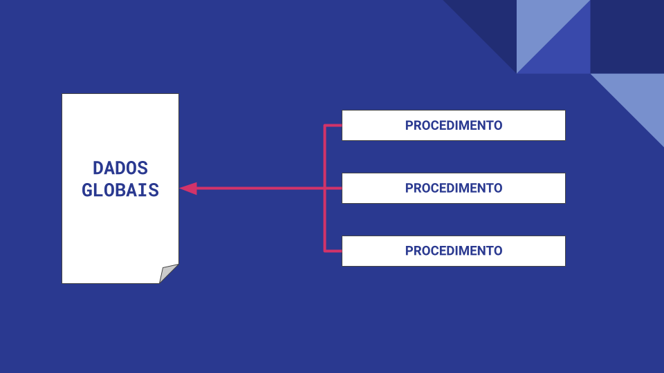

# História dos paradigmas de programação

Antes de entendermos um pouco mais sobre POO, vamos falar de história, e de como um programa era desenvolvido até a disseminação da programação orientada a objetos.

## Programação estruturada (modelo procedural)
Esse modelo consistia numa sequencia de instruções, comandos, rotinas, sub-rotinas ou funções associadas a um nome próprio, ou seja, um paradigma voltado a chamadas de procedimentos. Havia muito reaproveitamento de código, o que pode ser um beneficio, porém por ser de dificil manutenção diversas partes do código ficavam obsoletas e consumiam processamento.
As linguagens do tipo procedural, ou imperativas, em seus primordios, eram linguagens de máquina. Ou seja, é o paradigma mais antigo de todos. Linguagens baseadas neste paradigma são descritas como algoritmos.

A essencia da programação estruturada se resume a tres conceitos:
- A descrição de estados de uma máquina abstrata por valores de um conjunto de variáveis;
- Reconhecedores desses estados - expressões compostas por relações entre esses valores ou os resultados de operações utilizando valores;
- Comandos de atribuição e controle.

Alguns exemplos de linguagens que podem utilizar esse paradigma são:
- C
- D
- COBOL
- F
- Pascal

As principais vantagens desse paradigma são: sua eficiencia, o fato de ser bem estabelecido visto que é o mais antigo de todos, a modelagem natural de aplicações do mundo real, sua tipagem fraca e flexivel e seu entendimento fácil (o que pode ser ruim), tanto que linguagens procedurais sao utilizadas em cursos introdutórios de programação.

Já suas desvantagens são: sua difícil legibilidade, relacionamento indireto com a E/S, foco em como a tarefa deve ser realizada e não no que deve ser realizado, gera códigos confusos com tratamento dos dados misturados ao comportamento do programa.

Para mais informações sobre, [clique aqui](https://pt.wikipedia.org/wiki/Programa%C3%A7%C3%A3o_imperativa#Origens)

[Próximo capítulo](1-Introducao-POO.md)
