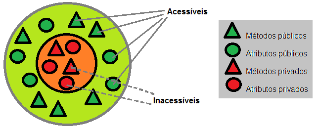

# Encapsulamento

Para evitar o acesso a dados de forma indevida e evitar principalemente problemas relacionados a segurança, temos o segundo pilar da POO.

Um exemplo disso seria por exemplo o saldo no banco. Se um usuário comum tiver acesso a esse dado e conseguir alterá-lo, poderia criar um problema enorme para a instituição, uma vez que ele pode colocar o saldo que quiser para si mesmo. Por isso é importante proteger a informação sensível.

## Níveis de acesso

Os níveis de acesso servem para definir o tipo de permissão a um determinado atributo. Podem existir 3 níveis:
- Público: todas as classes do programa tem acesso aos dados e métodos livremente.
- Protegido: somente classes derivadas da original tem total acesso aos atributos e métodos.
- Privado: o acesso aos dados é feito somente dentro da classe onde ele foi declarado.

~~~Java
public class Carro {
    private Double velocidade;
    private String modelo;
    private MecanismoAceleracao mecanismoAceleracao;
    private String cor;

    /* Repare que o mecanismo de aceleração é inserido no carro ao ser construído, e
        não o vemos nem podemos modificá-lo, isto é, não tem getter nem setter.
        Já o "modelo" pode ser visto, mas não alterado. */
    public Carro(String modelo, MecanismoAceleracao mecanismoAceleracao) {
        this.modelo = modelo;
        this.mecanismoAceleracao = mecanismoAceleracao;
        this.velocidade = 0;
    }

    public void acelerar() {
        this.mecanismoAceleracao.acelerar();
    }

    public void frear() {
        /* código do carro para frear */
    }

    public void acenderFarol() {
        /* código do carro para acender o farol */
    }

    public Double getVelocidade() {
        return this.velocidade
    }

    private void setVelocidade() {
        /* código para alterar a velocidade do carro */
        /* Como só o próprio carro deve calcular a velocidade, 
            esse método não pode ser chamado de fora, por isso é "private" */
    }

    public String getModelo() {
        return this.modelo;
    }

    public String getCor() {
        return this.cor;
    }

    /* podemos mudar a cor do carro quando quisermos */
    public void setCor(String cor) {
        this.cor = cor;
    }
}

~~~

~~~PHP
Class Carro {
    private $velocidade;
    private $modelo;
    private $mecanismoaceleracao;
    private $cor;

    /* Repare que o mecanismo de aceleração é inserido no carro ao ser construído, e
        não o vemos nem podemos modificá-lo, isto é, não tem getter nem setter.
        Já o "modelo" pode ser visto, mas não alterado. */
    public function Carro($modelo, mecanismoaceleracao) {
        $this->modelo = modelo;
        $this->mecanismoaceleracao = mecanismoaceleracao;
        $this->velocidade = 0;
    }

    public function acelerar() {
        /* código do carro para acelerar */
    }

    public function frear() {
        /* código do carro para frear */
    }

    public function acenderFarol() {
        /* código do carro para acender o farol */
    }

    public function getVelocidade() {
        return $this->velocidade;
    }

    private function setVelocidade() {
        /* código para alterar a velocidade do carro */
        /* Como só o próprio carro deve calcular a velocidade, 
            esse método não pode ser chamado de fora, por isso é "private" */
    }

    public function getModelo() {
        return $this->modelo;
    }

    public function getCor() {
        return $this->cor;
    }

    /* podemos mudar a cor do carro quando quisermos */
    public function setCor($cor) {
        $this->cor = cor;
    }
}

~~~

[Próximo capítulo](https://github.com/jeimoal/POO4Noobs/blob/main/3-Pilares-POO/4-Heranca.md)
