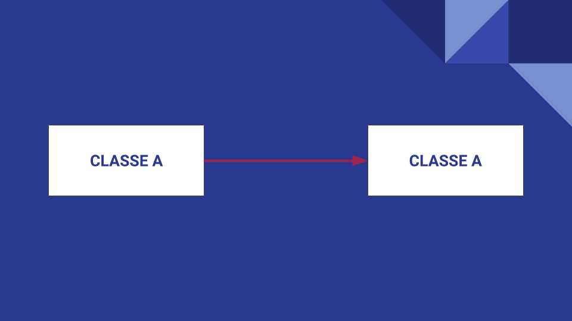
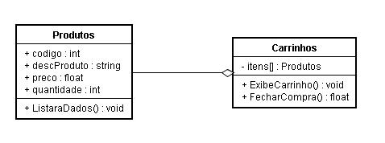

# Tipos de relacionamento

Assim como no mundo real, no virtual objetos também pode se relacionar. E existem basicamente 3 tipos de relacionamento.

A *associação* é o tipo mais comum de relacionamento e ocorre quando duas classes colaboram entre si. Nesse sentido a associação descreve os vínculos existentes entre as classes que interagem entre si. Seu objetivo principal é possibilitar a comunicação entre os objetos de duas classes. Ela pode ser tanto uni quanto bidirecional. No diagrama ela pode ser representada com uma seta ligando as duas classes.

 
Outra forma de relacionar classes é por meio da *agregação*. A agregação é um relacionamento estrutural por meio do qual parte de uma classe é associada a outra classe e parte dos objetos são associados a outras partes de objetos. Na agregação, uma classe agrega a outra mas mantém sua identidade própria. Por conta disso, a agregação é considerada um tipo especial de associação.

 
Já a multiplicidade busca estabelecer como as classes que formam uma associação fornecem informações umas as outras. Ela define os limites da quantidade de objetos aos quais um objeto está associado. Esses limites podem receber os valores: apenas um; zero ou muitos; um ou muitos; zero ou um; ou até um intervalo específico. Além disso a multiplicidade permite especificar o nível de dependência entre as classes envolvidas. 
 

[Proximo capitulo](../referencias/ReferenciasBibliograficas.md)