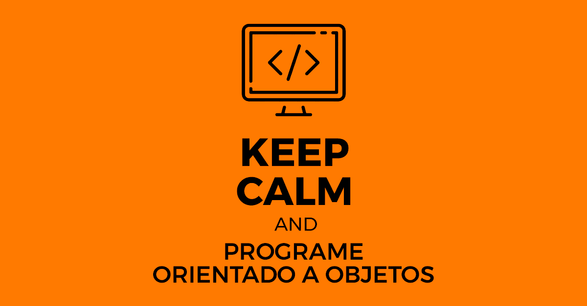

# Introdução a Programação Orientada a Objetos

Na programação orientada a objetos (POO), os objetos são organizados de acordo com características em comum, ou seja: classes, métodos e atributos. Dessa forma é mais fácil localizar, reutilizar e realizar a comunicação entre objetos.

Ela foi desenvolvida como uma tentativa de aproximar o mundo real do mundo virtual.

Na POO é implementado um conjunto de classes que definem os objetos presentes no sistema de software. Cada classe determina o comportamento (métodos) e os estados possíveis (atributos) de seus objetos, bem como seu relacionamento com os outros objetos.

## Principais conceitos

Mas para entendermos o que de fato é a programação orientada a objetos, temos que responder a pergunta primordial: o que é um objeto?
 
Em definição um objeto seria coisa material ou abstrata que pode ser percebida pelos sentidos e descrita por meio de suas características, comportamentos e estado atual. No caso da programação, essas características levam o nome de atributos, os comportamentos de método, e o estado continua sendo o estado.

Um objeto não pode ser simplesmente criado, ele precisa de um modelo para ser seguido. A esse modelo nós damos o nome de classe. Nós dizemos que o objeto é uma instancia da classe. Em sua definição seria um conjunto de características de um determinado "objeto" que pode ser utilizada de modelo para criar os objetos.

Outro conceito importante que vai nos auxiliar no entendimento da POO é o de evento. Eventos são interações (parâmetros) internas e externas que auxiliam na execução de um programa.

## [História](https://pt.wikipedia.org/wiki/Programa%C3%A7%C3%A3o_orientada_a_objetos)
 
 Apesar de ter surgido na década de 1970, acabou se popularizando em meados de 1990. Os principais conceitos da POO tem origem na Simula 67, uma linguagem de programação desenhada para fazer simulações.

 Atualmente o principal paradigma utilizado, e tem entre as linguagens de programação que o suportam:
 - Java
 - Python
 - Javascript
 - C
 - C#

[Próximo capítulo](pilaresDaPOO/pilaresDaPOO.md)
